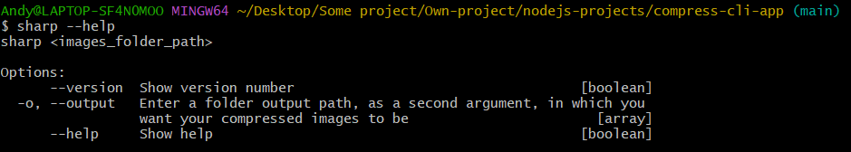

# compress-cli-app

> A CLI tool to perform image compression within a folder

# Screenshots

# Get started

Clone the repository and install all the packages

    git clone https://github.com/HandyyWeb/compress-cli-app.git
    npm install

Install globally

    npm install -g

# Documentation

To see how it works, run `sharp --help`

    sharp <images_folder_path>

    Options:
        --version  Show version number                                   [boolean]
    -o, --output   Enter a folder output path, as a second argument, in which you
                 want your compressed images to be                       [array]
        --help     Show help                                             [boolean]

# Basic Usage

Rename a specific within a specific folder by running the following command

    sharp <images_folder_path>

Example :

    sharp test // Compress all the images within the 'test' folder and output them within the 'test' folder

# Option

Use the `-o` or `--output` option to specify a new folder in which you want to output the compressed images

    sharp -o <current_images_folder_path> <new_images_folder_path>

Example :

    sharp -o test test-4 // Compress all the images within the 'test' folder and output them within the new 'test-4' folder

# Other libraries

- Sharp : [Sharp.js](https://github.com/lovell/sharp/)

# Author & Contacts

Andy Lebreton

E-mail : lebreton.andy@proton.me
